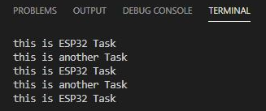

# Pràctica 4: Sistemes operatius en temps real
L'objectiu d'aquesta pràctica és entendre l'utilitat de les tasques i la seva implementació i funcionament. 

Bàsicament, les tasques sòn processos que s'executen fora del procés principal (loop) quan el processador està lliure. Això succeix, per exemple, quan implementem un "delay" d'un cert temps en el programa principal. És en aquest temps quan s'executaría la possible tasca o tasques que haguem creat.
___
## CODI DE LA PRÀCTICA
```
#include <Arduino.h>

void anotherTask ( void * parameter); 

void setup(){
    Serial.begin(112500);
    xTaskCreate( anotherTask, "another Task", 10000, NULL, 1, NULL); 
    }

void loop(){
    Serial.println("this is ESP32 Task");
    delay(1000);
    }

void anotherTask( void * parameter ){
    for(;;){
        Serial.println("this is another Task");
        delay(1000);
        }
    vTaskDelete( NULL );
}
```
___
## FUNCIONAMENT
El codi de la pràctica ens permetrà veure per la terminal quan s'està executant el procés principal (loop) i quan s'està executant la tasca.
___
### Setup
Al setup creem la tasca amb la funció xTaskCreate():
```
void setup(){
    Serial.begin(112500);
    xTaskCreate( anotherTask, "another Task", 10000, NULL, 1, NULL); 
    }
```
on els parametres introduïts són:
  
  * anotherTask: la funció que executa la tasca.
  * "anotherTask": és el nom que li donem a la tasca.
  * 10000: és el tamany de la tasca ("Stack size").
  * NULL: és el paràmetre de la tasca (en aquest cas no requereix cap).
  * 1: és la prioritat de la tasca. Com major sigui el nombre, major serà la prioritat. Això serà important en el cas que el programa tingui més d'una tasca a executar. S'executaràn abans les de major prioritat.
  * NULL: és l'identificador de la tasca.
___
### Loop
```
void loop(){
    Serial.println("this is ESP32 Task");
    delay(1000);
    }
```
El loop mostra per pantalla el missatge "this is ESP32 task". Tot seguit trobem un delay de 1000ms. És en aquest delay que s'executarà la tasca que hem creat.
___
### Definició de la tasca "anotherTask"
Es defineix la funcio que implementarà la tasca:
```
void anotherTask( void * parameter )
{
    for(;;){
        Serial.println("this is another Task");
        delay(1000);
        }
    vTaskDelete( NULL );
}
```
Aquesta implementa un bucle "for" infinit per tal que s'executi el procés tot el rato. Tot i així, s'ha d'afegir al final la funció "vTaskDelete()". Aquesta funció termina la tasca. És important afegir-la, encara que no arribi mai a executar-se, per tal que el programa ens funcioni correctament.

Dins d'aquest bucle trobem el codi que mostrarà pel terminal: "this is another Task", i posteriorment aplicarà un delay de 1000ms.
___
### Observacions del funcionament
El programa primerament mostra pel terminal: "this is ESP32 Task". Per tant s'executa el procés principal (loop).

Seguidament veiem que, mentres s'aplica el primer delay (el del loop), s'executa la tasca, ja que mostra pel terminal: "this is another Task".
 
Un cop finalitzat el delay del loop, tornem a veure pel terminal "this is ESP32 Task". S'ha tornat a executar el programa principal.
  
Tot seguit, haurà finalitzat el delay de la tasca i es mostrarà novament "this is another Task". S'ha tornat a executar la tasca.
   
Així successivament:



